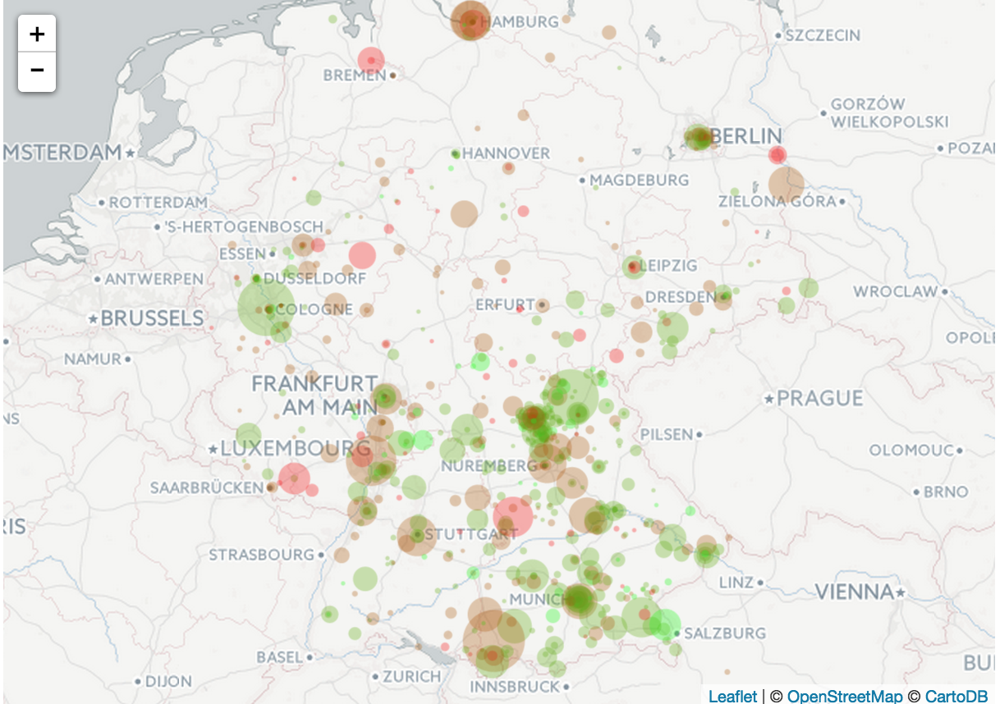

[](http://quantlet.de/index.php?p=info)

## [](http://quantlet.de/) **TXTBreweries** [](http://quantlet.de/d3/ia)

```yaml

Name of QuantLet : TXTBreweries

Published in : TXT

Description : 'Plots locations and customer ratings of German breweries. Red indicates bad scores
while green indicates good scores. The size of each bubble represents the number of beers that are
produced by an individual brewery.'

Keywords : data visualization, interactive, sentiment, visualization, plot

Keywords[new] : map, web data, opinion mining

See also : China_example, FWPMpowermap, TXTSimulation, TXTSimulationAttention

Author : Elisabeth Bommes

Example : interactive map of German breweries

TXTGermanBrewerieslonlat.RDS : 'Data set scraped from beeradvocate.com. Contains names and location
(longitude, latitude) of German breweries as well as their number of produced beers and average
rating'

```




```r

## Clear history
rm(list = ls(all = TRUE))
graphics.off()

## Install and load packages
libraries = c("leaflet", "htmlwidgets")
lapply(libraries, function(x) if (!(x %in% installed.packages())) {
    install.packages(x)
})
lapply(libraries, library, quietly = TRUE, character.only = TRUE)

# Set working directory
setwd("")

# Read data
data.df = readRDS("TXTGermanBrewerieslonlat.RDS")

# Score
data.df$Avg         = as.numeric(data.df$Avg)
data.df             = data.df[data.df$Avg != 0,]
data.df$NoBeer      = as.numeric(data.df$NoBeer)
data.df$NoBeer.size = data.df$NoBeer/max(data.df$NoBeer) * 20 + 1

# Classes for color coding
data.df$Avg.class                     = 0
data.df$Avg.class[data.df$Avg >  4]   = 1
data.df$Avg.class[data.df$Avg <= 4]   = 2
data.df$Avg.class[data.df$Avg <= 3.5] = 3
data.df$Avg.class[data.df$Avg <= 3]   = 4
data.df$Avg.class                     = as.factor(data.df$Avg.class)

# Color palette
pal = colorFactor(colorRampPalette( c("green", "red"), space = "rgb")(4),
                  domain = c("1", "2", "3", "4"))

# Plot
m  =  leaflet(data = data.df) %>% setView(lng = 10.3833, lat = 50.5167, zoom = 6)
m %>% addProviderTiles("OpenStreetMap.HOT") %>%
      addCircleMarkers(lng = ~lon, lat = ~lat, radius = ~data.df$NoBeer.size,
                       popup  = ~paste(Brewery, ": ", NoBeer, " beers", Avg, " as avg score",sep = ""),
                       color  = ~pal(Avg.class),
                       stroke = FALSE, fillOpacity = 0.8)

```
