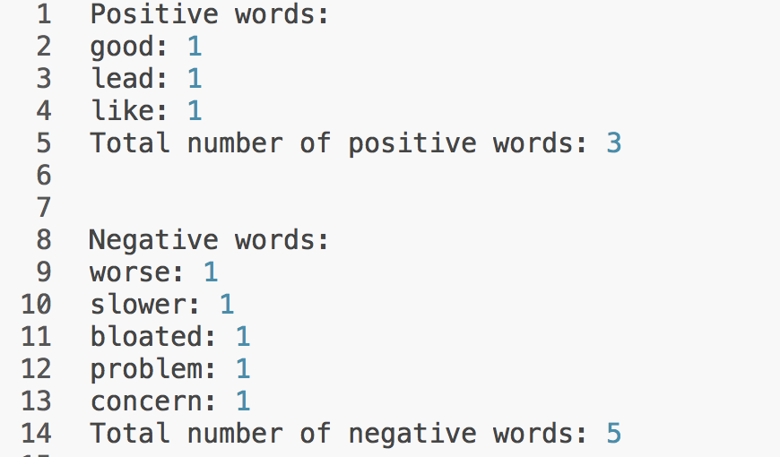

[](http://quantlet.de/index.php?p=info)

## [](http://quantlet.de/) **TXTMcDlm** [](http://quantlet.de/d3/ia)

```yaml

Name of QuantLet : TXTMcDlm

Published in : TXT

Description : 'Counts positive and negative words using the lexicon by Liu et al. Please install
required Python packages before usage: os, io, collections, nltk.'

Keywords : text mining, data mining, counts, sentiment

Keywords[new] : text, web data, nlp, tokenization, opinion mining

See also : TXTBreweries, TXTSimulation, TXTSimulationAttention, TXTnlp, TXTMcDlm

Author : Elisabeth Bommes

Example : Output

mcd_short.txt : 'Text scraped from Nasdaq community articles. Article is about Mc Donald''s. This
is the shortened version (example used in slides).'

bl_neg.csv : Negative words in BL lexicon

bl_pos.csv : Positive words in BL lexicon

```




```python

```
