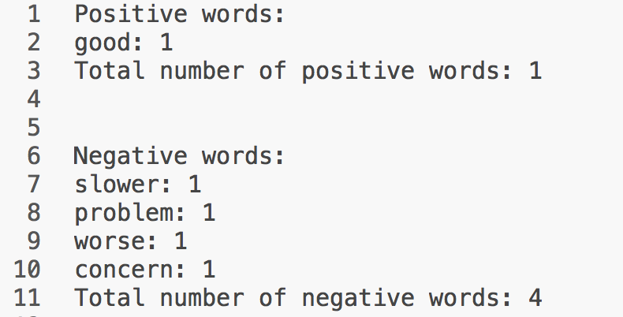

[](http://quantlet.de/)

## [](http://quantlet.de/) **TXTMcDlm** [](http://quantlet.de/)

```yaml

Name of QuantLet : TXTMcDlm

Published in : TXT

Description : 'Counts positive and negative words using the lexicon by Loughran and McDonald.
Please install required Python packages before usage: os, io, collections, nltk.'

Keywords : text mining, data mining, counts, sentiment

Keywords[new] : text, web data, nlp, tokenization, opinion mining

See also : TXTBreweries, TXTSimulation, TXTSimulationAttention, TXTnlp, TXTMcDbl

Author : Elisabeth Bommes

Example : Output

mcd_short.txt : 'Text scraped from Nasdaq community articles. Article is about Mc Donald's. This is
the shortened version (example used in slides).'

lm_neg.csv : Negative words in LM lexicon

lm_pos.csv : Positive words in LM lexicon

```




### PYTHON Code:
```python
import os
import io
from nltk.tokenize import word_tokenize

# Set working directory
os.chdir('')

### Functions
def rempct(s):
    punct_numb = '"#$%&\()*+,-./:;<=>?@[\\]^_`{|}~€$' + '0123456789' + "'"
    swopct = ""
    for letter in s:
        if letter not in punct_numb:
            swopct += letter.lower()
        else:
            swopct += ' '
    return swopct

def cleaner(txt):
    txt = str(txt.encode('ascii', 'ignore'))
    txt = txt.replace("\\n"," ")
    txt = txt.replace("\n"," ")
    txt = txt.replace('b"',"")
    return(txt)

def wordcount(words, dct):
    from collections import Counter

    counting = Counter(words)
    count    = []

    for key, value in counting.items():
        if key in dct:
            count.append([key, value])
    
    return count

def negwordcount(words, dct, negdct, lngram):

    from collections import Counter
    from nltk.util   import ngrams

    mid    = int(lngram/2)
    ng     = ngrams(words, lngram)
    nglist = []

    for grams in ng:
        nglist.append(grams)

    keeper = []
    n      = len(nglist)
    i      = 1
    for grams in nglist:
        if n - i < int(lngram / 2):
            mid = mid + 1

        if grams[mid] in dct:
            for j in grams:
                if j in negdct:
                    keeper.append(grams[mid])
                    break

        i = i + 1

    count = wordcount(keeper, dct)
    return count

# Read text file
txt = ''

with io.open('mcd_short.txt', 'r', encoding = 'UTF-8', errors = 'ignore') as infile:
    for line in infile:
        txt = txt + line

# Additional input
negdct = ["n't", 'not', 'never', 'no', 'neither', 'nor', 'none']
lngram = 7

### Read in LM lexicon
# Negative
ndct = ''
with io.open('lm_neg.csv', 'r', encoding = 'utf-8', errors = 'ignore') as infile:
    for line in infile:
        ndct = ndct + line

ndct = ndct.split('\n')
ndct = [rempct(entry) for entry in ndct]
ndct = [e for e in ndct if e]

# Positive
pdct = ''
with io.open('lm_pos.csv', 'r', encoding = 'utf-8', errors = 'ignore') as infile:
    for line in infile:
        pdct = pdct + line

pdct = pdct.split("\n")
pdct = [rempct(entry) for entry in pdct]
pdct = [e for e in pdct if e]

### Count positive and negative words
txt = cleaner(txt)
txt = rempct(txt)

# Tokenize -> Words
txt = word_tokenize(txt)

# Number of words in article
nwords = len(txt)

# Count words in lexicon
nwc = wordcount(txt, ndct)
pwc = wordcount(txt, pdct)

# Count negated words in lexicon
nwcneg = negwordcount(txt, ndct, negdct, lngram)
pwcneg = negwordcount(txt, pdct, negdct, lngram)

# Total number of positive/negative words
ntot = 0
for i in range(0, len(nwc)):
    ntot += nwc[i][1]

ptot = 0
for i in range(0, len(pwc)):
    ptot += pwc[i][1]

# Print results
print('Positive words:')
for i in range(0, len(pwc)):
	print(str(pwc[i][0]) + ': ' + str(pwc[i][1]))
print('Total number of positive words: ' + str(ptot))
print('\n')
print('Negative words:')
for i in range(0, len(nwc)):
	print(str(nwc[i][0]) + ': ' + str(nwc[i][1]))
print('Total number of negative words: ' + str(ntot))

```
