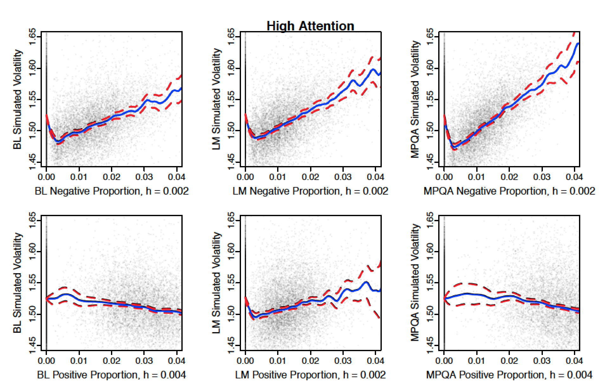
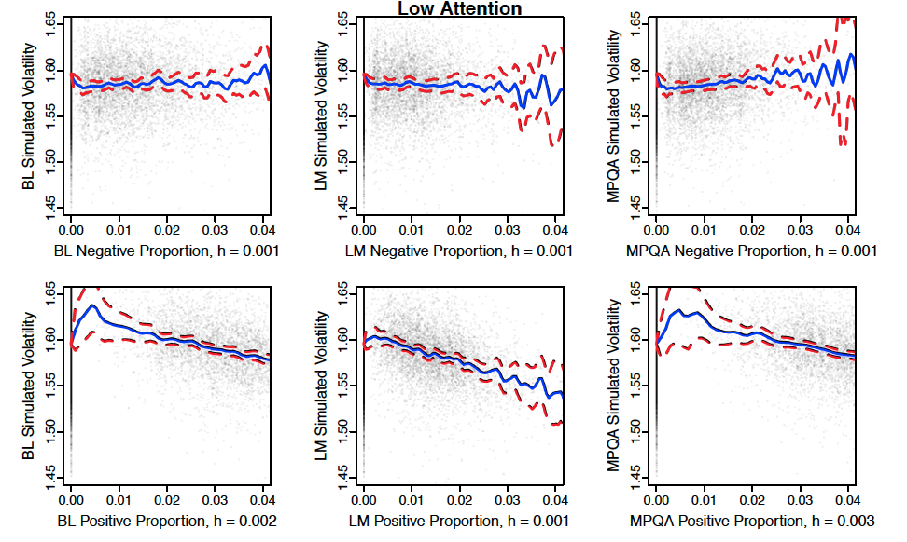

[](http://quantlet.de/index.php?p=info)

## [](http://quantlet.de/) **TXTSimulationAttention** [](http://quantlet.de/d3/ia)

```yaml

Name of QuantLet : TXTSimulationAttention

Published in : TXT

Description : 'Plots simulation results of stock volatility based on the regression results of the
attention panels. In the panel model, sentiment projections of three different sentiment lexica
have been used. Furthermore, the mean curve and corresponding confidence bands are plotted to
investigate the asymmetric reaction of volatility given positive and negative sentiment.'

Keywords : 'confidence-bands, estimation, nonparametric, nonparametric estimation, plot,
regression, scatterplot, simulation, volatility'

See also : 'MSEconfexpectile0.95, QRBSGumbel, SFSbootband, SFSbootband, SFSconfexpectile0.95,
SFSconfexpectile0.95, SPMengelconf, TXTBreweries, TXTSimulation, XFGSPDcb2'

Author : Elisabeth Bommes

Example : Plot of "High Attention Panel Regression", Plot of "Low Attention Panel Regression"

TXTSimulationAttentionHigh.RDS : 'Simulated sentiment and volatility values for the "High Attention
Panel Regression".'

TXTSimulationAttentionLow.RDS : 'Simulated sentiment and volatility values for the "Low Attention
Panel Regression".'

```






```r
# Clear variables and close windows
rm(list = ls(all = TRUE))
graphics.off()

# Set WD
path.path = ""
setwd(path.path)

# Install and load Packages
libraries = c("locfit", "KernSmooth")

lapply(libraries, function(x) if (!(x %in% installed.packages())) {
    install.packages(x)
})
lapply(libraries, library, quietly = TRUE, character.only = TRUE)

# Temporarily save plotting options
parmar = par("mar")
mfrow  = par("mfrow")

# Functions

conf.plot = function(x, y, lex, pn, ylim, xlim, main = ""){
    bw = dpill(x, y)
    if(bw < 0.001) bw = 0.002;
    
    ylab  = paste(lex, "Simulated Volatility", sep = " ")
    xlab  = paste(lex, pn, "Proportion, h =", round(bw, 3), sep = " ")
    
    # Remove some very extreme sentiment values (e.g = 0.1) (otherwise no nonparam. regression possible)
    min.x2 = 0
    max.x2 = quantile(x, 0.9999)
    y      = y[x < max.x2]
    x      = x[x < max.x2]
    
    # Compute confidence bands
    llr   = locfit(y ~ lp(x, h = bw, deg = 1), kern = "gauss", deg = 1)
    bands = scb(y ~ lp(x, h = bw, deg = 1), type = 1, ev = lfgrid(100),
                simul = TRUE, kern = "gauss", deg = 1)
    # Plot
    plot(NULL, pch  = 20, cex = 0.5, col = "#00000010",
         ylab = ylab, xlab = xlab, cex.axis = 0.9, tck = - 0.03, mgp = c(1.5, 0.3, 0),
         cex.lab = 1, ylim = ylim, xlim = xlim, main = main)
    
    points(x, y, pch = '.', col = "#00000010")
    lines(llr, col = "blue", lwd = 2)
    lines(bands$x, bands$lower, col = "red", lwd = 2, lty = "dashed")
    lines(bands$x, bands$upper, col = "red", lwd = 2, lty = "dashed")    
}


#### Low Attention

# Read data
sim.df = readRDS("TXTSimulationAttentionLow.RDS")

##### Plot for global ad hoc inspection
# Set global limits of y and x axis here to make plots comparable
limits.y = c(1.45, 1.65)
limits.x = c(0, 0.04)

# Set plotting parameters
par(mar   = c(3.0, 3.1, 1, 1.7))
par(mfrow = c(2, 3))

# Negative Proportion Plots
pn   = "Negative"

# BL Neg
x    = sim.df$BL_Neg_Proportion
y    = exp(sim.df$BL_SimulatedVolatility) # Note: we compare on exponential scale
lex  = "BL"
conf.plot(x, y, lex, pn, limits.y, limits.x)

# LM Neg
x    = sim.df$LM_Neg_Proportion
y    = exp(sim.df$LM_SimulatedVolatility)
lex  = "LM"
conf.plot(x, y, lex, pn, limits.y, limits.x, main = "Low Attention")

# MPQA Neg
x    = sim.df$MPQA_Neg_Proportion
y    = exp(sim.df$MPQA_SimulatedVolatility)
lex  = "MPQA"
conf.plot(x, y, lex, pn, limits.y, limits.x)

# Positive Proportion Plots
pn   = "Positive"

# BL Neg
x    = sim.df$BL_Pos_Proportion
y    = exp(sim.df$BL_SimulatedVolatility)
lex  = "BL"
conf.plot(x, y, lex, pn, limits.y, limits.x)

# LM Pos
x    = sim.df$LM_Pos_Proportion
y    = exp(sim.df$LM_SimulatedVolatility)
lex  = "LM"
conf.plot(x, y, lex, pn, limits.y, limits.x)

# MPQA Pos
x    = sim.df$MPQA_Pos_Proportion
y    = exp(sim.df$MPQA_SimulatedVolatility)
lex  = "MPQA"
conf.plot(x, y, lex, pn, limits.y, limits.x)

#### High Attention
sim.df = readRDS("TXTSimulationAttentionHigh.RDS")

##### Plot for global ad hoc inspection
# Set global limits of y and x axis here to make plots comparable
limits.y = c(1.45, 1.65)
limits.x = c(0, 0.04)

par(mar   = c(3.0, 3.1, 1, 1.7))
par(mfrow = c(2, 3))

# Negative Proportion Plots
pn   = "Negative"

# BL Neg
x    = sim.df$BL_Neg_Proportion
y    = exp(sim.df$BL_SimulatedVolatility) # Note: we compare on exponential scale
lex  = "BL"
conf.plot(x, y, lex, pn, limits.y, limits.x)

# LM Neg
x    = sim.df$LM_Neg_Proportion
y    = exp(sim.df$LM_SimulatedVolatility)
lex  = "LM"
conf.plot(x, y, lex, pn, limits.y, limits.x, main = "High Attention")

# MPQA Neg
x    = sim.df$MPQA_Neg_Proportion
y    = exp(sim.df$MPQA_SimulatedVolatility)
lex  = "MPQA"
conf.plot(x, y, lex, pn, limits.y, limits.x)

# Positive Proportion Plots
pn   = "Positive"

# BL Neg
x    = sim.df$BL_Pos_Proportion
y    = exp(sim.df$BL_SimulatedVolatility)
lex  = "BL"
conf.plot(x, y, lex, pn, limits.y, limits.x)

# LM Pos
x    = sim.df$LM_Pos_Proportion
y    = exp(sim.df$LM_SimulatedVolatility)
lex  = "LM"
conf.plot(x, y, lex, pn, limits.y, limits.x)

# MPQA Pos
x    = sim.df$MPQA_Pos_Proportion
y    = exp(sim.df$MPQA_SimulatedVolatility)
lex  = "MPQA"
conf.plot(x, y, lex, pn, limits.y, limits.x)

# Return to previous plotting settings
par(mar   = parmar)
par(mfrow = c(1, 1))
```
