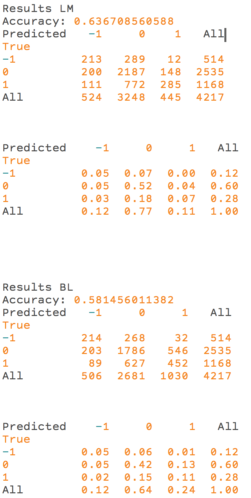

[](http://quantlet.de/)

## [](http://quantlet.de/) **TXTfpblexical** [](http://quantlet.de/)

```yaml

Name of QuantLet : TXTfpblexical

Published in : TXT

Description : 'Counts positive and negative words using the lexicon by Loughran and McDonald and
the lexicon by Bing Liu. Then, the results are evaluated by using the training set of Malo et al.
(2014) and computing a confusion matrix. This training set is available at
https://www.researchgate.net/publication/251231364_FinancialPhraseBank-v10 but a pickled and
preprocessed version is available in this quantlet folder. Please install required Python packages
before usage: os, io, collections, nltk, pickle.'

Keywords : text mining, data mining, counts, sentiment

Keywords[new] : text, web data, nlp, tokenization, opinion mining

See also : TXTBreweries, TXTSimulation, TXTSimulationAttention, TXTnlp, TXTMcDbl, TXTMcDlm

Author : Elisabeth Bommes

Submitted : Fri, August 12 2016 by Elisabeth Bommes

Example : Output

Datafile: 
- lem_Sentences_66Agree.p: Preprocessed version of Financial Phrase Bank by Malo et al. (2014)
- lm_neg.csv: Negative words in LM lexicon
- lm_pos.csv: Positive words in LM lexicon
- bl_neg.csv: Negative words in BL lexicon
- bl_pos.csv: Positive words in BL lexicon

```




### PYTHON Code:
```python
"""This module classifies sentiment for BL and LM lexicon."""
# Please download the Financial Phrase Bank by
# Malo, Pekka and Sinha, Ankur and Korhonen, Pekka and Wallenius, Jyrki and
# Takala, Pyry
# "Good debt or bad debt"
# Journal of the Association for Information Science and Technology, 2014

# https://www.researchgate.net/publication/251231364_FinancialPhraseBank-v10
import os
import io
import pickle
import pandas as pd

# set path
direct = ""


# functions
def tokenize(txt):
    """Simple white space tokenizer."""
    return txt.split()


def scores(row):
    """Change sentiment groups to numeric values."""
    if row["cla"] == "neutral":
        val = 0
    elif row["cla"] == "positive":
        val = 1
    else:
        val = -1

    return val


def accuracy(pred, actual):
    """Compute model accuracy."""
    return sum(pred == actual) / len(pred)


def subsample(df, n, seed):
    """Create subsample with oversampling."""
    con = df["sentiment"] == 0
    df2 = df.loc[con].sample(n, replace = True, random_state = seed)

    con = df["sentiment"] == 1
    df2 = df2.append(df.loc[con].sample(n, replace = True, random_state = seed))

    con = df["sentiment"] == -1
    df2 = df2.append(df.loc[con].sample(n, replace = True, random_state = seed))
    return df2


# lexical based
def wordcount(words, dct):
    """Count words in dictionary."""
    from collections import Counter

    counting = Counter(words)
    count = []

    for key, value in counting.items():
        if key in dct:
            count.append([key, value])

    return count


def negwordcount(words, dct, negdct, lngram):
    """Count negated words in dictionary."""
    from nltk.util import ngrams

    mid = int(lngram / 2)
    ng = ngrams(words, lngram)
    nglist = []

    for grams in ng:
        nglist.append(grams)

    keeper = []
    n = len(nglist)
    i = 1
    for grams in nglist:
        if n - i < int(lngram / 2):
            mid = mid + 1

        if grams[mid] in dct:
            for j in grams:
                if j in negdct:
                    keeper.append(grams[mid])
                    break

        i = i + 1

    count = wordcount(keeper, dct)

    return count


def findneg(word, wcneg):
    """Find negation word."""
    keywordneg = 0

    for j in range(0, len(wcneg)):
        if word in wcneg[j][0]:
            keywordneg = wcneg[j][1]
            break

    return keywordneg


def lexcnt(txt, pos_dct, neg_dct, negat_dct, lngram):
    """Count words and negated words in dictionary."""
    from nltk import word_tokenize
    txt = word_tokenize(txt)
    # Count words in lexicon
    pos_wc = wordcount(txt, pos_dct)
    pos_wc = [cnt[1] for cnt in pos_wc]
    pos_wc = sum(pos_wc)

    neg_wc = wordcount(txt, neg_dct)
    neg_wc = [cnt[1] for cnt in neg_wc]
    neg_wc = sum(neg_wc)

    # Count negated words in lexicon
    pos_wcneg = negwordcount(txt, pos_dct, negat_dct, lngram)
    pos_wcneg = [cnt[1] for cnt in pos_wcneg]
    pos_wcneg = sum(pos_wcneg)

    neg_wcneg = negwordcount(txt, neg_dct, negat_dct, lngram)
    neg_wcneg = [cnt[1] for cnt in neg_wcneg]
    neg_wcneg = sum(neg_wcneg)

    pos = pos_wc - (pos_wcneg) + neg_wcneg
    neg = neg_wc - (neg_wcneg) + pos_wcneg

    if pos > neg:
        out = 1
    elif pos < neg:
        out = -1
    else:
        out = 0

    return out


# read data

# change directory
os.chdir(direct + "financial_phrase_bank")

# load phrasebank
phrasebank = pickle.load(open("lem_Sentences_66Agree.p", "rb"))

sentences = pd.Series(phrasebank[0])
classif = pd.Series(phrasebank[1])
ident = pd.Series(range(0, len(classif)))

df = pd.DataFrame({"lemma": sentences,
                   "cla": classif,
                   "ident": ident,
                   })

df["sentiment"] = df.apply(scores, axis = 1)

negat_dct = ["n't", "not", "never", "no", "neither", "nor", "none"]
lngram = 7

phrasebank2 = pickle.load(open("sentences_Sentences_66Agree.p", "rb"))
os.chdir(direct + "lexica")

# LM
# negative dictionary (LM)
neg_dct = ""
with io.open("lm_negative.csv", "r", encoding = "utf-8", errors = "ignore") as infile:
    for line in infile:
        neg_dct = neg_dct + line

neg_dct = neg_dct.split("\n")
neg_dct = [e.lower() for e in neg_dct]


# positive dictionary (LM)
pos_dct = ""
with io.open("lm_positive.csv", "r", encoding = "utf-8", errors = "ignore") as infile:
    for line in infile:
        pos_dct = pos_dct + line

pos_dct = pos_dct.split("\n")
pos_dct = [e.lower() for e in pos_dct]


sentences = pd.Series(phrasebank2[0])
classif = pd.Series(phrasebank2[1])
ident = pd.Series(range(0, len(classif)))

df2 = pd.DataFrame({"sentence": sentences,
                    "cla": classif,
                    "ident": ident,
                    })

df2["sentiment"] = df2.apply(scores, axis = 1)

ident = pd.DataFrame({"ident": df["ident"]})

df2 = pd.merge(ident, df2)

pred2 = [lexcnt(s, pos_dct, neg_dct, negat_dct, lngram) for s in df2["sentence"]]
pred2 = pd.Series(pred2)

print("Results LM")
print("Accuracy: " + str(sum(pred2 == df2["sentiment"]) / len(pred2)))

print(pd.crosstab(df2["sentiment"], pred2, rownames = ["True"],
                  colnames = ["Predicted"], margins = True))

print("\n \n")

print(round(pd.crosstab(df2["sentiment"], pred2, rownames = ["True"],
                        colnames = ["Predicted"], margins = True,
                        normalize = True), 2))

# BL
# negative dictionary (BL)
neg_dct = ""
with io.open("bl_negative.csv", "r", encoding = "utf-8", errors = "ignore") as infile:
    for line in infile:
        neg_dct = neg_dct + line

neg_dct = neg_dct.split("\n")
neg_dct = [e.lower() for e in neg_dct]


# positive dictionary (BL)
pos_dct = ""
with io.open("bl_positive.csv", "r", encoding = "utf-8", errors = "ignore") as infile:
    for line in infile:
        pos_dct = pos_dct + line

pos_dct = pos_dct.split("\n")
pos_dct = [e.lower() for e in pos_dct]


sentences = pd.Series(phrasebank2[0])
classif = pd.Series(phrasebank2[1])
ident = pd.Series(range(0, len(classif)))

df2 = pd.DataFrame({"sentence": sentences,
                    "cla": classif,
                    "ident": ident,
                    })

df2["sentiment"] = df2.apply(scores, axis = 1)

ident = pd.DataFrame({"ident": df["ident"]})

df2 = pd.merge(ident, df2)

pred2 = [lexcnt(s, pos_dct, neg_dct, negat_dct, lngram) for s in df2["sentence"]]
pred2 = pd.Series(pred2)

print("\n \n \n \n")
print("Results BL")
print("Accuracy: " + str(sum(pred2 == df2["sentiment"]) / len(pred2)))

print(pd.crosstab(df2["sentiment"], pred2, rownames = ["True"],
                  colnames = ["Predicted"], margins = True))

print("\n \n")

print(round(pd.crosstab(df2["sentiment"], pred2, rownames = ["True"],
                        colnames = ["Predicted"], margins = True,
                        normalize = True), 2))

```
