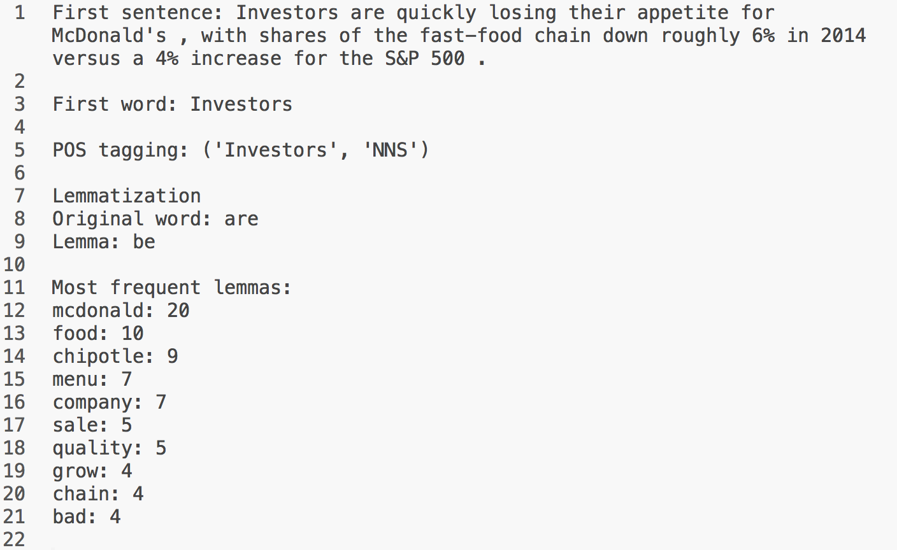

[](http://quantlet.de/)

## [](http://quantlet.de/) **TXTnlp** [](http://quantlet.de/)

```yaml

Name of QuantLet : TXTnlp

Published in : TXT

Description : 'Shows basic functionalities of natural language processing: sentence and word
tokenization, part-of-speech tagging, lemmatization, stopword removal and word counting. POS-tags
are converted to WordNet compatible tags such that the WordNet lemmatizer can be used. Please
install required Python packages before usage: os, io, types, collections, textblob, nltk.'

Keywords : text mining, data mining, counts

Keywords[new] : text, web data, nlp, tokenization, pos-tagging, lemmatization, wordnet

See also : TXTBreweries, TXTSimulation, TXTSimulationAttention, TXTMcDlm

Author : Elisabeth Bommes

Submitted : Elisabeth Bommes

Example : Output

mcd_long.txt : Text scraped from Nasdaq community articles. Article is about Mc Donald's.

```




### PYTHON Code:
```python
# Proper prior cleaning of text might improve results!
# Source of textfile: http://www.nasdaq.com/aspx/stockmarketnewsstoryprint.aspx?storyid=3-disastrous-mistakes-mcdonalds-should-regret-cm406246
# Please install packages if not installed yet!
import os
import io
import types
from textblob          import TextBlob, Word
from nltk.corpus       import stopwords
from nltk.stem.wordnet import WordNetLemmatizer as lemma

### Functions

# Function to convert Penn-Treebank POS tags to simplified (WordNet) POS tags
def posWN(posTB):
    if posTB.startswith('J'):
        return 'a'
    elif posTB.startswith('V'):
        return 'v' 
    elif posTB.startswith('N'):
        return 'n'
    elif posTB.startswith('R'):
        return 'r'
    elif posTB.startswith('A'):
        return 's'
    else:
        return ''

# POS function
def pos(blob):
    tok   = [token[0] for token in blob.pos_tags]
    tokW  = [Word(token) for token in tok]
    tokn  = len(tok)
    posTB = [pos[1] for pos in blob.pos_tags]
    posW  = [posWN(TB) for TB in posTB]
    return posW

# Tokenizer function
def token(blob):
    tok   = [token[0] for token in blob.pos_tags]
    return tok

# Lemmatizer function
def lem(article):
    from nltk.stem.wordnet import WordNetLemmatizer as lemma
    tokn = len(article.blob.words)
    posn = len(article.pos)
    if tokn == posn:
        words = article.blob.words
    else:
        words = [token[0] for token in article.blob.pos_tags]
        tokn  = len(words)
    
    lems = []
    for j in range(0, tokn):

        if article.pos[j] == '':
            verb = words[j].lemmatize('v')
            noun = words[j].lemmatize('n')

            if len(verb) == len(noun):
                lems.append(words[j])
            elif len(verb) < len(noun):
                lems.append(verb)
            else:
                lems.append(noun)
            
        else:
            lems.append(words[j].lemmatize(article.pos[j]))

    lems        = [token.lower() for token in lems]
    article.lem = lems
    return article

# Counter and stopwords remover
def cntr(lems, stpw):
    from collections import Counter

    cnt = Counter(lems)
    cnt = [(cnt[entry], entry) for entry in cnt]
    cnt.sort()
    cnt.reverse()

    wordfreq = []
    for i in range(0, len(cnt)):
        if cnt[i][1] not in stpw:
            wordfreq.append(cnt[i])

    return wordfreq


# Set working directory
os.chdir('')

# Read text file
txt = ''

with io.open('mcd_long.txt', 'r', encoding = 'UTF-8', errors = 'ignore') as infile:
    for line in infile:
        txt = txt + line

txt = TextBlob(txt)

### Basics
# Print first sentence
print('First sentence: ' + str(txt.sentences[0]) + '\n')

# Print first word
print('First word: ' + str(txt.words[0]) + '\n')

# Print first part of speech tag
print('POS tagging: ' + str(txt.tags[0]) + '\n')

### Tokens and POS tags
txttok = token(txt)
txtpos = pos(txt)

### WordNet lemmatizer
# Create namespace
article = types.SimpleNamespace()

# Assign parts of namespace
article.blob = txt
article.pos  = txtpos

# Lemmatize
article = lem(article)

# Show part of results
print('Lemmatization')
print('Original word: ' + str(txttok[1]))
print('Lemma: ' + str(article.lem[1]) + '\n')


### Count words and remove stopwords
stpw = stopwords.words('english')
stpw.extend("'")

cnt = cntr(article.lem, stpw)

print('Most frequent lemmas:')
# Show 10 most frequent lemmas
for ntry in range(0, 10):
    print(cnt[ntry][1] + ': ' + str(cnt[ntry][0]))

```
